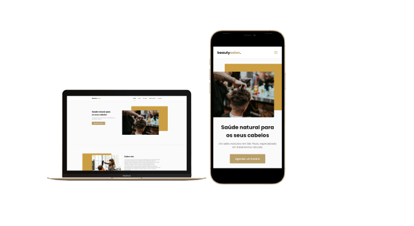

<h1 align="center">
  
</h1>

<h1 align="center">
  
</h1>

<h2 align="center">🚀 NLW#6 Together </h2>

  <a href="#design">Design</a> •
  <a href="#why">Why</a> •
  <a href="#layout">Layout</a> •
  <a href="#tech-stack">Tech Stack</a> •  
  <a href="#api">API</a> • 
  <a href="#project">Project</a> 

 

 <h2 id="design">🎨 Design</h2>

<h2 align="center"></h2>

<h2 id="why">🤔 Why?</h2>

<h4>PT-BR</h4>
Este design foi criado pelos impulssionadores da Rocketseat e apresentado no NLW#6 Together - Origin, O projeto apresentado neste repositório foi criado na trilha Origin, onde passamos pelo aprendizado e práticas de HTML, CSS e JavaScript, onde foram ministradas aulas para iniciantes ou para aqueles que queriam reforçar esse conhecimento teórico e técnico.    

Fiz algumas modicações para tornar-lho um pouco diferente da aplicação original, adicionei animações nos icones, mudei algumas bordas, modifiquei imagem e troquei a paleta de cores do layout original, já que com as variavéis criadas, as cores podem ser facilmente modificadas.   

<h4>English</h4>
This design was created by Rocketseat Boosters and featured at NLW#6 Together - Origin, The project presented in this repository was created on the Origin track, where we went through the learning and practices of HTML, CSS, and JavaScript, where classes were given to beginners or those who wanted to reinforce this theoretical and technical knowledge.   

I made some modifications to make it a little different from the original website, I added animations to the icons, changed some borders, modified the image, and changed the color palette of the original layout since, with the variables created, the colors can be easily modified.    

<h2 id="layout">🟩 Layout</h2>      

The project layout is in Figma, here at this <a href="https://www.figma.com/community/file/1009807319507822993">link</a>
  
  

<h2 id="tech-stack">🚀 Tech Stack</h2>
<ul>
  <li><a href="https://developer.mozilla.org/en-US/docs/Web/HTML">HTML</a></li>
  <li><a href="https://developer.mozilla.org/en-US/docs/Web/CSS">CSS</a></li>
  <li><a href="https://developer.mozilla.org/en-US/docs/Web/JavaScript/Reference">JavaScript</a></li> 
</ul>  

<h2 id="api">🗺️ API</h2>
<ul>
 <li><a href="https://scrollrevealjs.org/">ScrollReveal</li>
  <li><a href="https://swiperjs.com/">Swiper</li>
</ul>   

<h2 id="project">🔨 Project</h2>
<ul>
 <li><a href="https://roberto-devL.github.io/OriginSix/">Beautysaloon</li>
</ul>

<h2 align="center">🤝 Como Contribuir?</h2>
 

⭐️ Deixe sua estrela 
🛠Encontre e reporte bugs 
📥 Envie PRs para ajudar a resolver bugs 
↪️ Compartilhe o Repositório

